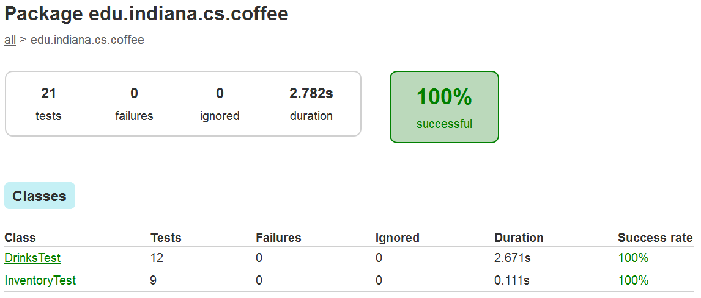
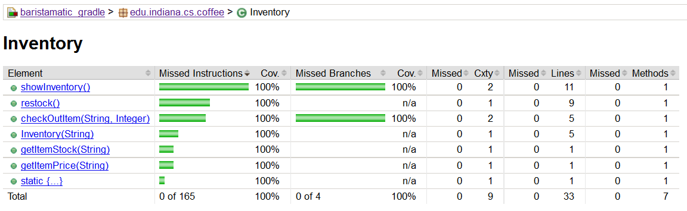
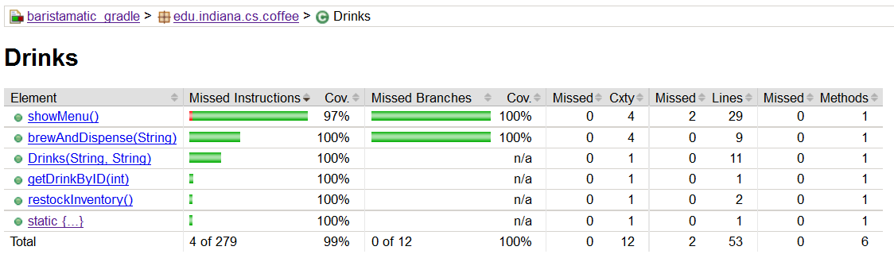

# Barista-matic Assignment

##Problem Description  ([pdf here](documents/Problem Statement.pdf))
Create a simulator of an automatic coffee dispensing machine, called the Barista-matic. The machine maintains an inventory of drink ingredients, and is able to dispense a fixed set of possible drinks by combining these ingredients in different amounts.

<br>

##Project Details
```
Implemented:
- java main code
- java unit tests

Integrated:
- gradle build automation system
- junit test framework
- jacoco code coverage library
- log4j logging service

Project Root: "./baristamatic_gradle"

Main Class: "edu.indiana.cs.coffee.EntryPoint"

Main Code Location:
	./baristamatic_gradle/src/main/java/...

Unit Tests Code Location:
	./baristamatic_gradle/src/test/java/...

Unit Tests HTML report file will be at:
	./baristamatic_gradle/build/reports/tests/index.html
	
Code Coverage HTML report file will be at:
	./baristamatic_gradle/build/reports/coverage/index.html

```


<br>

##Build System  ([Gradle](https://discuss.gradle.org/t/gradle-2-14-released/18040))

```gradle
------------------------------------------------------------
Essential tasks runnable from root project
------------------------------------------------------------

Build tasks
-----------
build - Assembles and tests this project. Also generates unit test & code coverage reports.
clean - Deletes the build directory and output jar file.
jar - Assembles a jar archive and exports it to 'baristamatic-3/baristamatic_gradle/'.
run - Runs this project as a JVM application

Help tasks
----------
tasks - Displays the tasks runnable from root project 'baristamatic_gradle'.

```

<br><br>

##Input Resources
  - [inventory.json](baristamatic_gradle/res/inventory.json) has JSON records which contains all ingredients.
  - [menu.json](baristamatic_gradle/res/menu.json) has JSON records which contains all drinks menu with their recipe.

<br>

##How to run?
- Install Gradle Build Tool (click [here](https://www.javacodegeeks.com/2013/04/how-to-install-gradle-2.html) for reference)
- For eclipse, install Buildship 1.0.16 Plugin for Gradle 2.14 (click [here](https://projects.eclipse.org/projects/tools.buildship/releases/1.0.16) for reference)

- Inside ```baristamatic_gradle``` directory run any of the above mentioned gradle tasks, for example, run any one of the following line - 
  ```bash
  gradle build

  gradle run

  gradle jar
  ```
- How to run executable jar -

  ```bash
  java -jar ./baristamatic_gradle.jar
  ```

To see a sample video demo of this project, click at 
[//]: # (http://meta.stackexchange.com/questions/2133/whats-the-recommended-syntax-for-an-image-with-a-link)
[//]: # (http://meta.stackexchange.com/questions/38915/creating-an-image-link-in-markdown-format)
<a href="https://www.youtube.com/watch?v=CHrUhd3zcYY" rel="java: baristamatic demo 1">]</a>


<br><br>

##Java Unit Tests   ([junit tool](http://junit.org/junit4/))


<br><br>

##Java Code Coverage  ([jacoco tool](http://www.eclemma.org/jacoco/))

<br><br>


<br>

##Dev Platform
```
Project Type: Gradle Project

Gradle Version: 2.14.1

Java Version: Oracle Java 1.8 (64 bit)

IDE: GGTS 3.6.4.RELEASE (which is built on Eclipse Luna SR1 4.4.2)

OS: Linux (ubuntu 14.04) 64 bit
```
